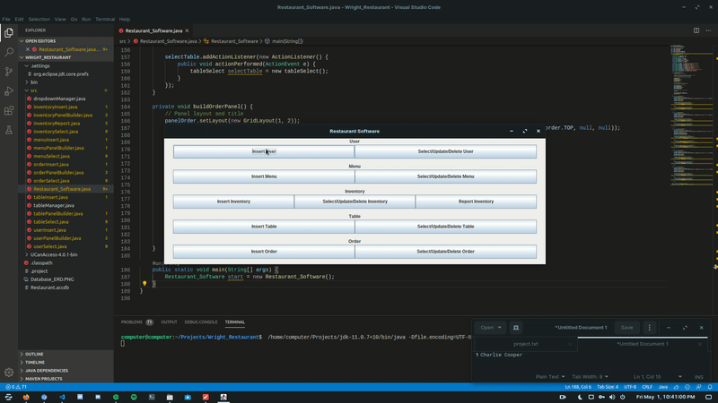
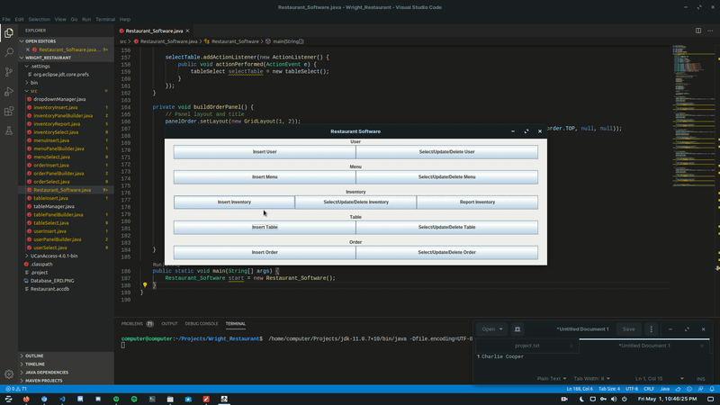
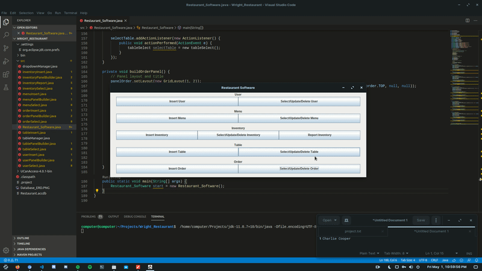
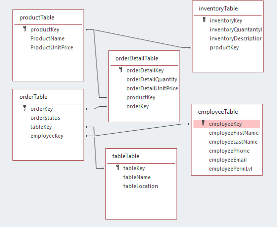

# Restaurant-Database-Management-Software
A Java Swing application for managing a restaurants database

This project uses UCanAccess 4.0.1 to execute sql commands to input data into Restaurant.accdb

## Inserts
### Part 1

### Part 2

## Selects/Updates
### Part 1

### Part 2

## Deletes

## Entity-Relationship Diagram
